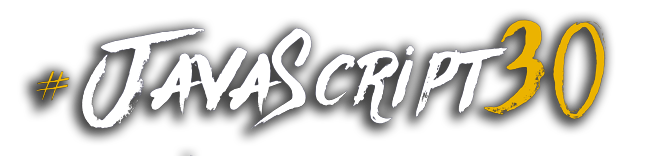

# JavaScript Bobni

<dl>
<dt>Spletna stran za pridobitev event kod tipk na tipkovnici:</dt>
<dd><a href="https://keycode.info">Pritisni katerokoli tipko, da dobite JavaScript event kodo pritisnjene tipke</a></dd>
</dl>

<dl>
<dt>Končni izdelek:</dt>
<dd><a href="https://danilojezernik.github.io/javascript_bobni/">GitHub page</a></dd>
</dl>

**Primer povezave v HTML**:
```html
<div data-key="65" class="key">
    <kbd>A</kbd>
    <span class="sound">clap</span>
</div>
<!-- data-key="65" povezuje audio s tipko -->
```
```html
<audio data-key="65" src="sounds/clap.wav"></audio>
```

Podatki za tipko **A** iz konzole po dodani funkciji:
```javascript
window.addEventListener("keydown", function(e) {
    console.log(e);
});

key: "a"
keyCode: 65
type: "keydown"
```

Dolžina prehoda v **style.css**:
```css
.key {
    transition: all .07s ease;
}
```

Velikost transformacije v **style.css**:
```css
.playing {
    transform: scale(1.1); /* lestvica 1.1 */
}
```

JavaScript:

```javascript
function playSound(e) {
    if (!audio) return; // ustavi audio ko se preneha predvajati
};
```
```javascript
function playSound(e) {
    audio.currentTime = 0; //previje na začetek
};
```
```javascript
function playSound(e) {
    key.classList.add("playing"); //izbere key in iz classList doda stil .playing!
};
```
```javascript
function removeTransition(e) {
    //funkcija, ki izbriše .playing class
};
```
```javascript
const keys = document.querySelectorAll(".key"); // izbere.key class
```
```javascript
keys.forEach(key => key.addEventListener("transitionend", removeTransition));
//po vsakem koncu se izbriše .playing class
```



